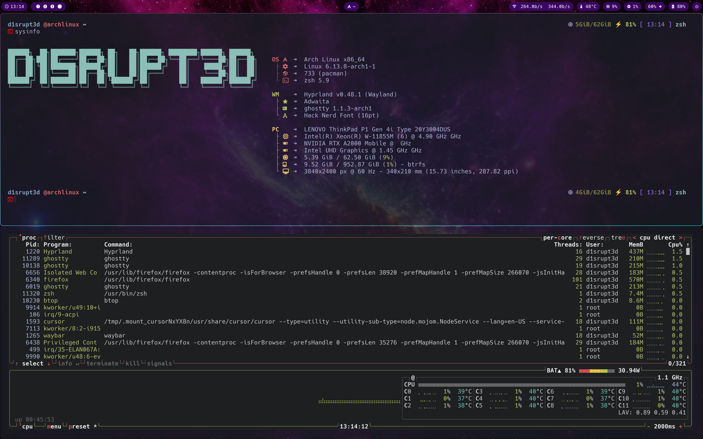

# Hyprland Dotfiles

A collection of dotfiles for a modern Hyprland setup on Arch Linux.

## 🖼️ Screenshots


*Main desktop with Waybar*


*Terminal with custom prompt and ASCII art*

## Components

- **Btop**: System monitor
- **Dunst**: Lightweight notification daemon
- **Fastfetch**: System information tool with custom ASCII art
- **Ghostty**: Modern terminal emulator with Tokyo Night theme
- **Hyprland**: Modern Wayland compositor
- **Hypridle**: Idle management tool
- **Hyprlock**: Screen locker
- **Hyprpaper**: Wallpaper daemon
- **Hyprshot**: Screenshot tool
- **Starship**: Cross-shell prompt with system information
- **Swaync**: Modern notification daemon with control center
- **Thunar**: File manager
- **Waybar**: Highly customizable status bar
- **Wofi**: Application launcher
- **Wlogout**: Logout menu
- **Zsh**: Shell configuration with custom aliases and functions

## Directory Structure

```
.
├── assets/        # Assets and screenshots
├── btop/          # System monitor configuration
├── dunst/         # Notification daemon configuration
├── fastfetch/     # System information configuration with custom ASCII art
├── ghostty/       # Terminal configuration with Tokyo Night theme
├── hypr/          # Hyprland configuration
├── hypridle/      # Idle management tool configuration
├── hyprlock/      # Screen locker configuration
├── hyprpaper/     # Wallpaper daemon configuration
├── hyprshot/      # Screenshot tool configuration
├── scripts/       # Utility scripts
├── starship/      # Cross-shell prompt configuration
├── swaync/        # Modern notification daemon configuration
├── thunar/        # File manager configuration
├── wallpapers/    # Wallpaper collection
├── waybar/        # Status bar configuration
├── wlogout/       # Logout menu configuration
├── wofi/          # Application launcher configuration
└── zsh/           # Shell configuration with custom aliases
```

## Features

- Modern Wayland compositor with Hyprland
- Customizable status bar with Waybar
- Notification system with Dunst and Swaync
- Application launchers with Wofi
- Logout menu with Wlogout
- System monitoring with Btop
- System information display with Fastfetch and custom ASCII art
- Terminal configuration with Ghostty and Tokyo Night theme
- Cross-shell prompt with Starship
- Custom Zsh configuration with aliases and functions
- Screenshot tool with Hyprshot
- Screen locker with Hyprlock
- Wallpaper management with Hyprpaper
- Idle management with Hypridle
